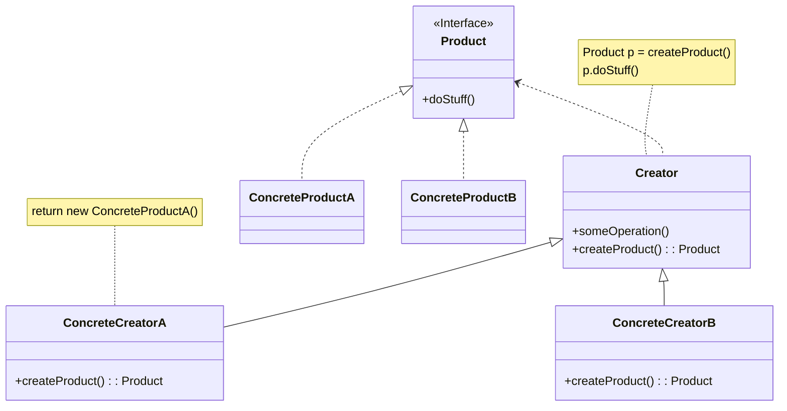

# Factory Method



- Product: CreatorやConcentrateCreatorによって生成されるオブジェクトに共通なインターフェース
- ConcentrateProduct: Productの具象クラス
- Creator: 新しいProductオブジェクトを返すFactory Methodを宣言する
- ConcetrateCreator: 異なる型のProductオブジェクトを返すようにFactory Methodを上書きする

## サンプルコード

徒歩・自転車・自動車の3つの移動手段から選択肢して10秒間移動した時の距離を計算・出力する

```bash
g++ factoryMethod.cpp -std=c++17
./a.out [walk|bicycle|car] <interval>

# Go!
# ....5....10
# 
# [Information]
# - vehicle:  walk
# - speed:    1[m/sec]
# - interval: 10[sec]
# - distance: 10[m]
```